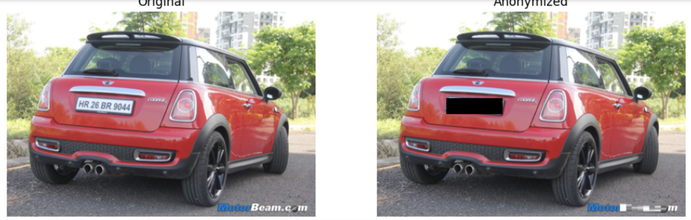
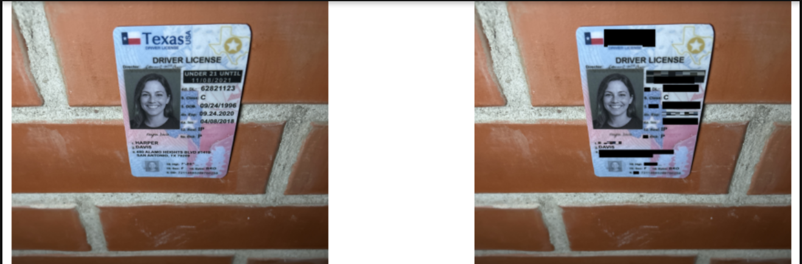

# **Deep Adaptive Image Anonymizer (DAIA) – PyTorch**

A complete **image anonymization system** that automatically detects sensitive regions (faces, signatures, license plates, addresses, etc.) and anonymizes them using a **Deep Adaptive EfficientNet-B0 classifier + anonymization filters**.

This project was built using **PyTorch**, runs fully on **GPU**, and supports **batch anonymization** for large datasets such as documents, ID cards, and selfies.

---

# 🚀 **Features**

### ✅ **1. Automatic PII Detection**

Detects sensitive regions such as:

* Faces
* Text & printed details
* Signatures
* License plates
* ID-card regions

### ✅ **2. Deep Adaptive Filter Selection**

Uses a trained **EfficientNet-B0** classifier to choose the best anonymization filter:

* Pixelation
* Blur
* Blackout
* Custom anonymization (optional)

### ✅ **3. Fast, GPU-Accelerated Processing**

* Built with **PyTorch + CUDA**
* Custom data pipeline
* Batch anonymization supported

### ✅ **4. Fully Modular Project Structure**

```
src/
  ├── Batch Anonymizer & Prediction Checker.ipynb
  └── DeepAdaptiveAnonymizer_EfficientNetB0_PyTorch.ipynb
```

### ✅ **5. NO Datasets Stored on GitHub**

All dataset links are provided via:

```
data/data-links.txt
```

---

# 📂 **Project Structure**

```
project-root/
│
├── data/
│    └── data-links.txt       # dataset download sources
│
├── models/                  # trained model weights (.pth)
│   ├── EfficientNetB0_best.pth
│   ├── EfficientNetB0_last.pth
│   └── efficientnet_adaptive_masker.onnx
│
├── src/
│   ├── Batch Anonymizer & Prediction Checker.ipynb
│   └── DeepAdaptiveAnonymizer_EfficientNetB0_PyTorch.ipynb
│
├── results/                 # NOT uploaded
├── test/                    # NOT uploaded
├── .gitignore
├── requirements.txt
└── README.md
```

---

# 📥 **Dataset Sources**

We do **not** upload datasets due to copyright restrictions.
Download them from the official sources and place them inside:

```
data/
```

### **Datasets Used**

1. Car License Plate (DatasetNinja)
   [https://datasetninja.com/car-license-plate](https://datasetninja.com/car-license-plate)

2. Car License Plate Dataset (Mendeley)
   [https://data.mendeley.com/datasets/wk6n8fhx3c/1](https://data.mendeley.com/datasets/wk6n8fhx3c/1)

3. Synthetic USA Driver License
   [https://www.kaggle.com/datasets/unidpro/synthetic-usa-driver-license](https://www.kaggle.com/datasets/unidpro/synthetic-usa-driver-license)

4. CelebA Face Dataset
   [https://www.kaggle.com/datasets/jessicali9530/celeba-dataset](https://www.kaggle.com/datasets/jessicali9530/celeba-dataset)

These links are also included in `data/data-links.txt`.

---

# 🛠️ **Installation**

## 1️⃣ Create a conda environment

```bash
conda create -n daia python=3.10 -y
conda activate daia
```

## 2️⃣ Install dependencies

```bash
pip install -r requirements.txt
```

## 3️⃣ Install PyTorch (CUDA build)

```bash
pip install torch torchvision torchaudio --index-url https://download.pytorch.org/whl/cu124
```

---

# 🔧 **Training the Classifier**

```bash
python src/DeepAdaptiveAnonymizer_EfficientNetB0_PyTorch.ipynb
```

This trains the EfficientNet-B0 classifier and saves:

```
models/efficientnet_adaptive_masker_best.pth
models/efficientnet_adaptive_masker_final.pth
```

---

# 🎯 **Run Inference / Anonymization**

### **Batch Anonymization**

```bash
python src/Batch Anonymizer & Prediction Checker.ipynb --input data/ --output results/
```

---

# 📸 **Examples**






---

# 🧠 **Model Architecture**

* Backbone: **EfficientNet-B0**
* 3-class anonymization selector
* Region detection + adaptive filtering engine
* Notebook-only implementation

---

# 🔒 **Ethical Use**

This project is intended for:

* Privacy preservation
* Research & academic work
* Automated document anonymization

❌ Not for illegal ID manipulation.

---

# 👤 **Author**

**KESHU (Keshav)**
Deep Learning & Computer Vision Engineer
Project: **Deep Adaptive Image Anonymizer (DAIA)**

---

# ⭐ **Contribute / Star the Repo**

If you like the project, ⭐ the repo or contribute improvements!
